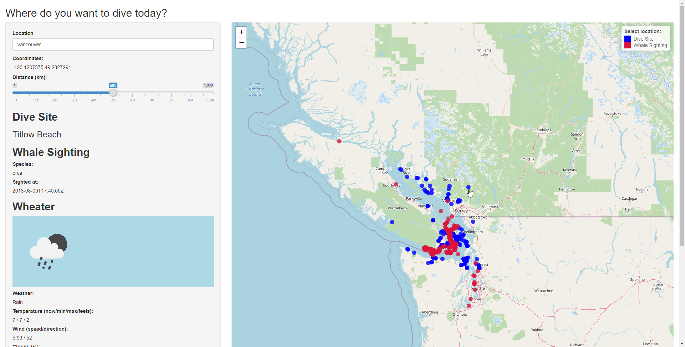
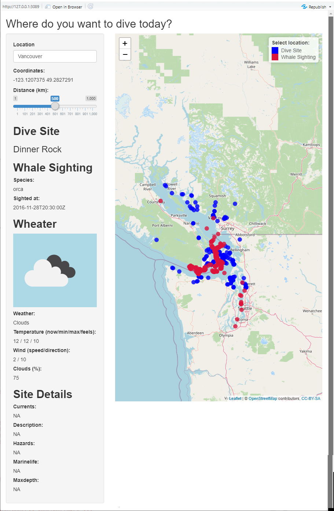

```{r setup, include=FALSE}
knitr::opts_chunk$set(echo = TRUE)
knitr::opts_chunk$set(message=FALSE)
```
The *Dive site checker app* enables you to find dive sites everywhere in the world and to check the weather forecast and the closest whale sightings in the past in that area.

## Using the app on Shiny.io
You can try the dive sites checker app on shinyapps.io. [Check your dive destination](https://claravetter.shinyapps.io/divesites/). 


### Example: Vancouver


### User interface
#### Location input
When opening the app, you can search for the location of your next diving vacation, e.g. Gili Trawangan, and look up any dive sites in an area. Simply specify the location in the search bar. The default is Vancouver.The map will zoom on to the specified location (if you typed in an existing address). Any input compatile with the Google geocoding API is porcessed.

#### Distance slider
With the distance slider below the search bar, you can zoom in or out. The app shows you the coordinates of your searched location.

#### Map display

The map is rendered with Leaflet. Dive sites in the area are shown as blue points on the map. Additionally, red points show where previous whale sighting have been. 

#### Side bar
When you click on one of the dive sites, you get more information in the side bar:

##### Dive site 

Details of the site (e.g. name, hazards, marinelife, ...), 

##### Weather 
Weather details and associated icon are displayed.

##### Whale sightings
Information on previous whale sighting (including which kind of whale it was).

## Installation
### External R libraries 
To use the app, you need the following external R libraries. 
```{r libraries}
library(shiny)
library(leaflet)
library(ggmap)
library(dplyr)
library(reticulate)

```
### External Python libraries 
The following python libraries are used

-import urllib
-import urllib.request
-import json

They allow the REST API calls and associated JSON processing

### API keys
For the Google Maps Geocoding API and the OpenWeatherMap API respected keys need to be requsted and added in the follwing source files:

- server.R

```{r}
      register_google(key = "xxxxxxxxx")
```
- weather_openweatermap_api.py: Variable _appid_ at the beginning of the file


## Application structure 

The dive site application consists of an Shiny app with the standard files
-ui.R
-server.R

In addition, there is a python package _apis_ with the below content.

### Shiney structure

The layout chosen is _sidebar_layout_:
```{r}
  # Sidebar layout
  sidebarLayout(
    sidebarPanel(
    ),
    mainPanel(
    )
  )
```
The sidebar contains the reactive slots for location input and deetail display. The main panel displays the leaflet map.
### API package 

#### Dive site API 
For dive site retrieval, I use http://api.divesites.com. The implementation is in _apis/dive_api.py_.

#### Weather API 

For weather data, I tried two APIs:
-	National Oceanic and Atmospheric Administration weather data api: https://api.weather.gov/
- OpenWeatherMap API : http://api.openweathermap.org/

The respective implementations are in _apis/weather_weathergov_api.py_ and _apis/weather_openweathermap_api.py_
#### Whale API

#### Geocoding

Google Maps Geocoding API using

```{r}
library(ggmap)
```

and the _geocode()_ function.
