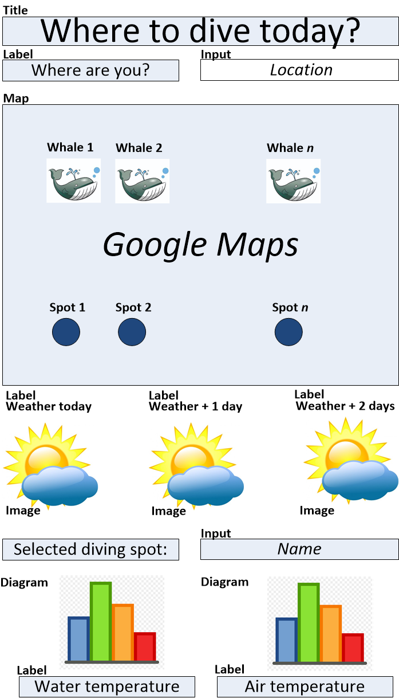

## My Project

This web app displays the diving spots around any location in the world on a Google map. In addition, close whale sightings are shown.

{width="2.7115693350831145in" height="4.736111111111111in"}

Clicking on a diving spot shows weather forecast and temperature diagrams.
The data displayed is obtained from the below APIs:

-   Google maps places API: https://maps.googleapis.com/maps/api

-   Dive sizes API: http://[api.divesites.com](http://api.divesites.com/)

-   National Oceanic and Atmospheric Administration weather data API:

> <https://api.weather.gov/>

-   Whale sighting API: [http://hotline.whalemuseum.org](http://hotline.whalemuseum.org/)

## Implementation Steps

I will use a reactive programming style to update the different GUI elements if user input changes values. The program reacts on location input and selection of a diving spot.

**Step 1:** Create "rough GUI" for map display with dummy API calls for dive sites.

Purpose: Allow entry of location name and display respective Google map segment, using the Google Geocoding API and the renderGoogle\_map()function of the googleway library.

**Step 2:** Create a python function / classes for the dive site API

Purpose: Retrieve dive site coordinates around a specified location.

**Step 3:** Combine the "rough GUI" with the dive site API

Purpose: Create a first version on the app, where entering a location displays dive sites on a map.

**Step 4:** Create a python function / classes for the NOAA weather API

Purpose: Retrieve weather forecast data for a specified location.

**Step 5:** Add the weather forecast data to the GUI

Purpose: Allow selection of a diving spot (e.g. by entering a diving spot number or by clicking on the map) and retrieve and display the respective weather data.

**Step 6:** Complete the app

Purpose: E.g. proper reaction on exceptional cases (as invalid inputs).

**Step 7:** Testing and documentation

Purpose: Ensure that I did not make programming errors and make the code more readable where required.

**Step 8:** Go diving

Purpose: Continue testing with real life test cases.

## The Code

### Programming Languages

### Packages

#### R Packages

library(shiny) : For creating the interactive web app 

library(googleway) : For accessing Google Maps APIs to retrieve data and plot maps

library(reticulate) : For accessing python classes and calling python functions using py\_run\_file() and py\_run\_string() .

#### Python Packages

import json : For JSON object (de-)coding 

import requests : For performing the HTTP API requests 

### Functions and Objects

**Object:** Shiny user interface object diveUI : Define the respective GUI elements for the app: title, labels, map, images, input fields, diagrams

{width="2.7003926071741033in" height="4.930555555555555in"}

**Object:** Diving spot divingSpot : Name, coordinates, and other data for a diving spot as retrieved by the API.

**Object:** Whale sighting whaleSighting : Coordinates, and other data for a whale sighting as retrieved by the API.

**Object:** Weather forecast weatherData : Weather forecast per location as retrieved by the API.

**Function:** Shiny server function diveServer(): Define the server logic for reacting on user input, triggering REST API calls, and creation of GUI elements. This function will be implemented in R.

**Function:** locationInput(): React on location input and perform API calls and creation of display content. This function will be implemented in R.

**Function:** geoCoding(): Determine the coordinates of the location entered using the Google Geocoding API. This function will be implemented in R (library(googleway)) and or python.

**Function:** getDivingSpots(): Get diving spots (divingSpot objects) around the selected coordinates. This function will be implemented in R (wrapper) and python.

**Function:** getWhaleSightings(): Get whale sightings (whaleSighting objects) around the selected coordinates. This function will be implemented in R (wrapper) and python.

**Function:** displayMap(): Draw a map segment around the selected coordinates, including the diving spots and whale sighting locations.

**Function:** divingSpotInput(): React on diving spot input and perform API calls and creation of display content. This function will be implemented in R.

**Function:** getWeatherForecast(): Get weather forecast data (weatherData object) for the selected diving spot coordinates. This function will be implemented in R (wrapper) and python.

**Function:** displayWeatherForecast(): Display the weather forecast (from weatherData object). This function will be implemented in R.

**Function:** displayWeatherIcons(): Display the weather forecast icons (from weatherData object). This function will be implemented in R.

**Function:** displayWeatherTemperatureCharts(): Display the weather temperature charts (from weatherData object). This function will be implemented in R.